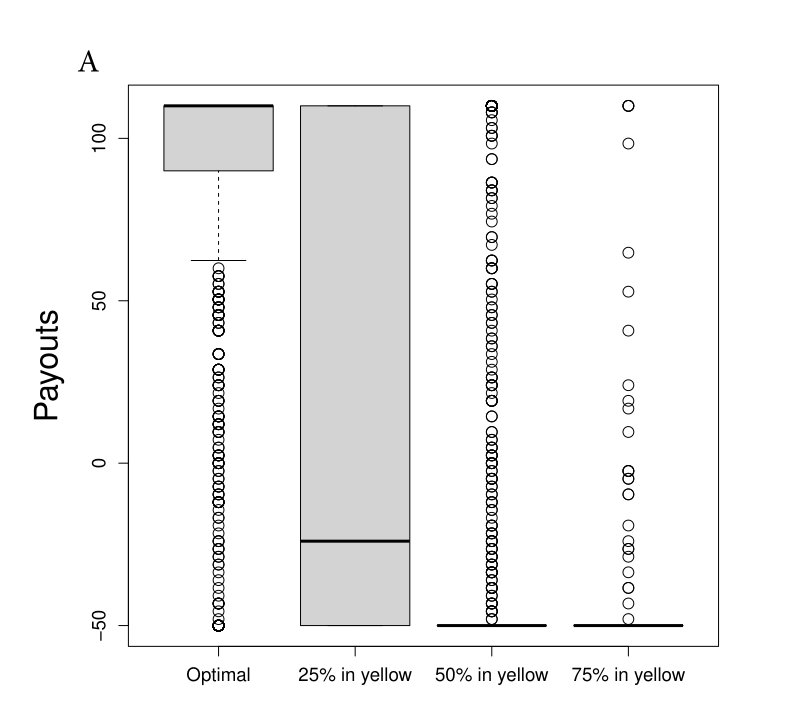
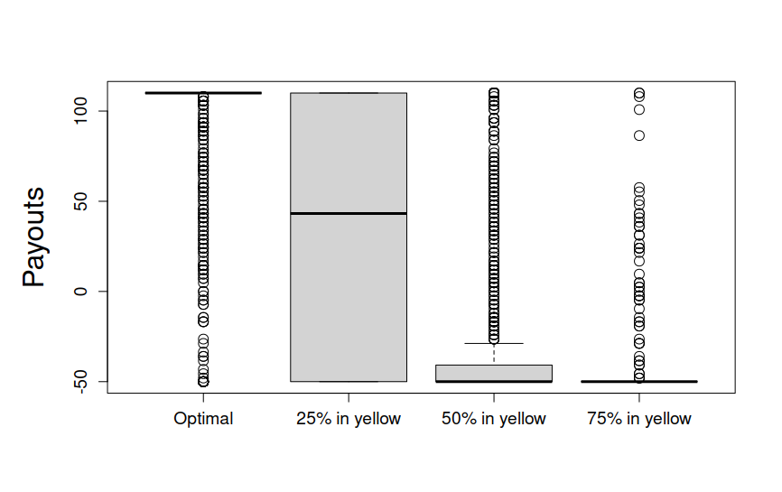

**Appendix and supplementary materials**

**Field journal**

**11/25/24**

I begin the search for potentially reproducible articles through [the **Open Science Framework** website](https://osf.io/), using the search terms *behavioral finance, behavioral economics, decision making,* and *neuroeconomics*. Among the results obtained, I investigate those that have the **"Open Data"** and **"Open Materials"** badges, assuming that it will be more likely to find studies that fit the established criteria there. After reading several articles that remain after this initial screening, I come to *Outlier blindness: A neurobiological foundation for neglect of financial risk,* by Payzan-LeNestour and Woodford (2022), and on its seventh page, I find [the link to download](https://supplementarymat.weebly.com) the study materials, within which the materials for *Craving money? Evidence from the laboratory and the field* (Payzan-LeNestour and Doran, 2024) are also found. Its abstract mentions combining 'elements of Pavlovian psychology' with 'standard economic theory' in a single model, so I include it as an object of the case studies.

I also find *Age-related differences in ventral striatal and default mode network function during reciprocated trust* (Fareri et al., 2022), which investigates the relationship between **aging and changes in executive functions** such as decision-making, specifically in the financial domain when involving other people. In the **Data and code availability** section, they include three links to download the material used.

***Outlier blindness: A neurobiological foundation for neglect of financial risk,*** **by Payzan-LeNestour and Woodford (2022).**

12/04/2024

After downloading the material from Dropbox, I open RStudio and, following the instructions, adjust the directories of the function *setwd* in the file Outlier.R on lines 3, 37, 75, 108, and 144 to correspond to the folders on my computer. I run the complete code and this results in the following error:

``` r
Error in data.frame(treatment = levels(ATDs1s2$Variable), mean = 
tapply(ATDs1s2$value, : arguments imply differing number of rows: 0, 2
```

Which is corrected by adding to line 652:

``` r
ATDs1s2$Variable <- factor(ATDs1s2$Variable)
```

After this, I run the complete code again and a new failure appears because the *setwd* function is used again on line 883 to set a sixth folder as the directory where the file *earningsbyuser.csv* should be found:

``` r
>setwd("/Users/danielagrinblatt/Desktop/Elise/Data")
Error in setwd("/Users/danielagrinblatt/Desktop/Elise/Data"):
no es posible cambiar el directorio de trabajo
```

This raises my suspicions, as there are only 5 folders with data to download in the Dropbox enabled for this purpose. After verifying that I do not have the mentioned .csv file, I contact the principal author of the study, Elise Payzan-LeNestour, to see if she can provide it to me to continue with the process.


12/18/24

After two weeks with no news from the principal author of the article, I contact the co-author Michael Woodford via email for the same purpose.


12/09/24

***Craving money? Evidence from the laboratory and the field*****, by Payzan-LeNestour and Doran (2024).**

After reading the README.md and python_requirements.txt files, I install Conda 24.11.1 to try to reproduce the study within the environment that this software provides. I create an environment called *craving* with Python 3.10 (not specified by the authors, but a plausible option for the time the study was conducted, given that it was a stable version compatible with the key libraries) and pandas 1.5.3 and numpy 1.24.4, given that these two are the only requirements specified. Once the installation of these versions is verified, I use Jupyter Lab 4.3.3 to open the file 01_combine_participant_data.ipynb, I modify *data_path* as the authors indicate to adjust it to the folder on my computer where the data is located, and I proceed to run the code, which leads me to the following error:

``` python
ImportError: Missing optional dependency 'xlrd'.
Install xlrd >= 1.0.0 for Excel support Use pip or conda to install xlrd.
```

Therefore, it cannot be reproduced with only the two conditions indicated in the python_requirements.txt file. I proceed to install xlrd and modify the line 17:

``` python
temp = pd.read_excel(x, sheet_name = 'results', header = None)
```

With:

``` python
temp = pd.read_excel(x, sheet_name = 'results', header = None, engine = ‘xlrd’)
```

To indicate to pandas which engine to use in reading the .xls files, which leads to the following error:

``` python
XLRDError: Unsupported format, or corrupt file:
Expected BOF record; found b'\x00\x00\x00\x01Bud1'
```

Which could be due to a problem in the spreadsheets containing the data. I open the .xls files with LibreOffice Calc version: 24.2.7.2 (X86_64) to verify that they can be read correctly. Once this is verified, I proceed to install version 1.2.0 of xlrd. Given that the .xls format is becoming obsolete, the problem could be due to the current xlrd version not being suitable for that format, but rather for the more recent .xlsx. This leads to an incompatibility error with pandas:

``` python
ImportError: Pandas requires version '2.0.1' or newer of 'xlrd' (version 
'1.2.0' currently installed).
```

I then downgrade the Pandas version to 1.1.5, compatible with xlrd 1.2.0, but this turns out to be incompatible with Python version 3.10. I then choose to create a new environment, *Craving2*, with Python 3.9, Pandas 1.1.5, and xlrd 1.2.0. Upon execution, I get again the error:

``` python
XLRDError: Unsupported format, or corrupt file: Expected BOF record; found 
b'\x00\x00\x00\x01Bud1'
```

What seems to lead to a loop with no result whatsoever.

12/18/2024

I start from scratch in case I had made any mistakes, such as the omission of a crucial step in the previous attempt. I delete the environment and create a new one, with the same requirements indicated in the python_requirements.txt file (pandas\>=1.5.3 and numpy\>=1.24.4) and arrive at the same results.

***Age-related differences in ventral striatal and default mode network function during reciprocated trust*****, by Fareri et al. (2022).**

12/19/24

After reading the README.md file, I install FSL, Singularity, and PyDeface, for which no version is specified. I proceed to create the containers indicated in the aforementioned README.md file: heudiconv (version: 0.5.4), mriqc (version: 0.15.1), and fmriprep (version: 20.1.0). Here the first problem arises, as I get an error when installing mriqc:

``` bash
FATAL: While performing build: conveyor failed to get: GET 
https://index.docker.io/v2/nipreps/mriqc/manifests/0.15.1: 
MANIFEST_UNKNOWN: manifest unknown; unknown tag=0.15.1
```

Error because such version is not available. I consequently proceed to install 22.0.6, as it is one of the oldest versions that still has stable maintenance. However, the version number already indicates that several intermediate versions have existed, which could pose a problem for the rest of the process.

12/24/24

Once the containers are created, I open the Linux terminal and follow the instructions to download the data with the command:

``` bash
datalad clone https://github.com/OpenNeuroDatasets/ds003745.git bids
```

Which produces a new error. I check the existence [of the repository](https://github.com/OpenNeuroDatasets/ds003745) still exists. Having verified its existence, I download the folders manually to continue the process, understanding that this is a minor issue and that there will be no difference when reading the files whether they reached the hard drive via a manual download or by using a terminal command.

12/30/24

Following the instructions in the README.md file, I open the Linux terminal from the *srndna-trustgame-main* folder and run the following command:

``` bash
bash code/run_fmriprep.sh
```

Which results in a loop error. Although not specified in the protocol to follow, given that the error includes the phrase 'Permission denied', I try running it with administrator privileges, and receive a loop error again. I consult ChatGPT-4o, and after trying the trivial solutions (removing spaces in the file path, verifying that the file actually exists and is in the folder, or checking that it is executable), I run the script in debug mode:

``` bash
bash -x code/run_fmriprep.sh
```

And it leads me to a third loop error. ChatGPT-4o offers me the solution of changing the working path in the fmriprep.sh file to one on my computer. In the Linux terminal I execute:

``` bash
nano code/fmriprep.sh
```

And I modify:

``` bash
scratchdir=/data/scratch/\`whoami\`

if \[ ! -d \$scratchdir \]; then

    *mkdir -p \$scratchdir

fi
```

With:

``` bash

scratchdir=/home/\`whoami\`/scratch

if \[ ! -d \$scratchdir \]; then

    mkdir -p \$scratchdir

fi
```

Then, I make the folder:

``` bash
mkdir -p /home/`whoami`/scratch
```

I run it again and receive a new error. In this case, it is due to a problem with the fmriprep-20.1.0.simg image. I try to solve it with the following commands in the terminal:

``` bash
sudo docker pull nipreps/fmriprep:20.1.0
```

``` bash
singularity build fmriprep-20.1.0.simg docker://nipreps/fmriprep:20.1.0
```

Both without error. Then:

``` bash
nano code/fmriprep.sh
```

To modify the path to current location of the file .simg. Again:

``` bash
bash code/run_fmriprep.sh
```

And it leads me to a new loop error, in this case due to missing license-related files. Since they are not strictly necessary, I just comment out those lines of code. Following this, I encounter a new loop error.

01/02/2025

The last loop error is also related to the licenses needed. I create an empty file called *license.txt* to bypass this issue and run again:

``` bash
 bash code/run_fmriprep.sh
```

Which yields a new error related to the BIDS standard structure that the folders should follow.

I check the structure of the *bids* folder at [[https://bids-standard.github.io/bids-validator/]{.underline}](https://bids-standard.github.io/bids-validator/) and this yields several errors, including:

```         
1. PARTICIPANT_ID_MISMATCH:
        a. Severidad: Error.
        b. Descripción: Hay un desajuste entre los IDs de participantes definidos en el             archivo participants.tsv y otros archivos del dataset.
        c. Ubicación: /participants.tsv.
        
    2. SCANS_FILENAME_NOT_MATCH_DATASET:
        a. Severidad: Error.
        b. Descripción: Los nombres de los archivos en los TSV de escaneos no coinciden               con los archivos presentes en el dataset.
        c. Ubicación: Varias carpetas, por ejemplo:
            i. /sub-122/sub-122_scans.tsv
            ii. /sub-110/sub-110_scans.tsv
            iii. /sub-118/sub-118_scans.tsv
            iv. Y otros sujetos (sub-106, sub-140, etc.).
```

Exported into the file ids-validator-output.json.

Since this is no longer a problem related to an aspect of the computational environment, but rather to the files themselves that should be reproduced, resolving it is beyond my competence, and I conclude that this study could also not be reproduced.

01/29/25

***Stubborn by Design: Neurobiological Foundation of Maladaptive Risk-Taking at Downturn Onsets*****, by Payzan-LeNestour et al. (2024).**

Due to the failure in the attempt to reproduce the previous articles, I check again on the OSF website. I type *behavioral finance* into its search engine and one of the first results that appears is Payzan-LeNestour et al. (2024). Seeing that everything necessary to reproduce it is uploaded, I download the materials and, after checking that there is no README or similar file containing the instructions, I open *run_full_script.R* with RStudio and realize that the instructions are in the form of a comment within it.

RStudio indicates that necessary packages for executing said code are missing, which I proceed to install, and after that, I adjust the setwd() function to adapt it to the folders on my computer. I execute the complete code and receive an error because the windows() function is not available in RStudio for Linux:

``` r
Error in windows(width = 8, height = 8) : no se pudo encontrar la función 
"windows"
```

I rewrite the present code, as well as the code in the *payoff rule.R* file, to substitute said function with ggplot(). I run it again, and after this, the *script* runs to the end without any additional problems, and I obtain tables and graphs to compare with those of the published article.

01/30/25

All graphs correspond faithfully to those published with the exception of *Figure 10 A*, where a clear difference is seen, especially in the *Optimal* condition. *Figures 6C,* *6D, 8C, and 9B* of the article are not generated when executing said code. I also obtain identical results for *Table 1*, as well as results with slight variations (even considering rounding) for *Table 3* and its extension as *Table 8* in Appendix F, and similar results with small variations due to rounding in *Table 4*.





*Comparison of Figure 10 A in the original article (above) and the one obtained for this study (below).*

02/06/25

I try rewriting the original code, substituting the problematic windows() function with dev.new() instead of ggplot(). When running the code, I obtain identical results to the previous occasion: the same discrepancies in *Figure 10 A* and *Table 3*, and I also do not obtain the graphs that I failed to obtain using ggplot().

18/04/26

Since the first reproduction attempt, the original study and its materials are no longer available, but a updated version, *Stubborn by Design: When past rewards keep agents betting on known losses*.

I start substituting the windows() function for dev.new(). Then I get an error:

``` r
Error en t.test.formula(betting_rate_bc ~ uncertainty, data = data_6, : 
  cannot use 'paired' in formula method
```

So I modify line 298:

``` r
t_test_6 <- t.test(betting_rate_bc ~ uncertainty, data = data_6,
                   alternative = 'less', paired = TRUE)
```

With:

``` r
t_test_6 <- t.test(
  x = data_6$betting_rate_bc[data_6$uncertainty == "High"],
  y = data_6$betting_rate_bc[data_6$uncertainty == "Low"],
  paired = TRUE,
  alternative = 'less'
)
```

After that, there is an error in a path that seems to be hardcoded:

``` r
'C:/Users/yyszq/Dropbox/Elise Sign Tracking/Data and coding/Reproducibility/Supplementary Codes/payoff rule.R'
```

11/01/25

I resume the search for articles to test their CR. I access the [Journal of Economic Behavior and Organization](https://www.sciencedirect.com/journal/journal-of-economic-behavior-and-organization) and type [*behavioral finance*](https://www.sciencedirect.com/search?qs=behavioral+finance&pub=Journal+of+Economic+Behavior+%26+Organization&cid=271649&years=2025%2C2023%2C2024%2C2022%2C2021%2C2020&lastSelectedFacet=accessTypes&accessTypes=openaccess) in the search box. Then, I limit the scope to the years 2020-2025 and *Open access & Open archive*. If the search returns over 50 articles, I analyze only the 50 first. I proceed the same way with the terms [*behavioral economics*](https://www.sciencedirect.com/search?qs=behavioral+economics&pub=Journal+of+Economic+Behavior+%26+Organization&cid=271649&years=2025%2C2023%2C2024%2C2022%2C2021%2C2020&lastSelectedFacet=accessTypes&accessTypes=openaccess)*, [neuroeconomics](https://www.sciencedirect.com/search?qs=neuroeconomics&pub=Journal+of+Economic+Behavior+%26+Organization&cid=271649&years=2025%2C2023%2C2024%2C2022%2C2021%2C2020&lastSelectedFacet=accessTypes&accessTypes=openaccess),* and [*decision making*](https://www.sciencedirect.com/search?qs=decision+making&pub=Journal+of+Economic+Behavior+%26+Organization&cid=271649&years=2025%2C2023%2C2024%2C2022%2C2021%2C2020&lastSelectedFacet=accessTypes&accessTypes=openaccess).

I look for articles including the queries (or derivative forms, such as *moral decision-making* or *group decision-making* instead of just *decision-making*) in the keywords or title. Also, if none of the queries is present in either the title or the keywords but there is a clear reference such as talking about 'investment behavior' that suggest overlapping of behavioral sciences or neuroscience with economics, the article is included.

I do the same in [Journal of Economic Psychology](https://www.sciencedirect.com/journal/journal-of-economic-psychology) ([*behavioral finance*](https://www.sciencedirect.com/search?qs=behavioral+finance&pub=Journal+of+Economic+Psychology&cid=271667&years=2025%2C2024%2C2023%2C2022%2C2021%2C2020&lastSelectedFacet=accessTypes&accessTypes=openaccess)*, [behavioral economics](https://www.sciencedirect.com/search?qs=behavioral+economics&pub=Journal+of+Economic+Psychology&cid=271667&years=2025%2C2024%2C2023%2C2022%2C2021%2C2020&lastSelectedFacet=accessTypes&accessTypes=openaccess), [neuroeconomics](https://www.sciencedirect.com/search?qs=neuroeconomics&pub=Journal+of+Economic+Psychology&cid=271667&years=2025%2C2024%2C2023%2C2022%2C2021%2C2020&lastSelectedFacet=accessTypes&accessTypes=openaccess)* and [*decision making*](https://www.sciencedirect.com/search?qs=decision+making&pub=Journal+of+Economic+Psychology&cid=271667&years=2025%2C2024%2C2023%2C2022%2C2021%2C2020&lastSelectedFacet=accessTypes&accessTypes=openaccess)), and [Frontiers in Behavioral Economics](https://www.frontiersin.org/journals/behavioral-economics) ([*behavioral finance*](https://www.frontiersin.org/journals/behavioral-economics/articles?type=24&query=behavioral%20finance&publication-date=01%2F01%2F2020-01%2F12%2F2025)*, [behavioral economics](https://www.frontiersin.org/journals/behavioral-economics/articles?type=24&query=behavioral%20economics&publication-date=01%2F01%2F2020-01%2F12%2F2025), [neuroeconomics](https://www.frontiersin.org/journals/behavioral-economics/articles?type=24&query=neuroeconomics&publication-date=01%2F01%2F2020-01%2F12%2F2025)* and [*decision making*](https://www.frontiersin.org/journals/behavioral-economics/articles?type=24&query=decision%20making&publication-date=01%2F01%2F2020-01%2F12%2F2025)), with the type *Original Research* and date 01/01/2020-01/12/2025 for the latter. The process yields 45 articles to work with.

11/05/25

The first classification gives 10 papers non-reproducible (either because nothing is said about sharing data or because explicitly states data cannot be shared), 20 papers that offer data upon request and 15 with the data publicly available.

12/16/25

***Bad bankers no more? Truth-telling and (dis)honesty in the finance industry*****, by Huber & Huber (2020).**

No computational environment is shared. I resume the process of reproduction with the papers that offer data publicly available with Huber & Huber (2020). I visit [the link](https://osf.io/c9dbj/) offered in the paper and download the files. I run the *notebook.Rmd* and get some warnings, until I get an error on "Table B3 - Ordered logit regression on the proportion of honest reports for financial professionals and students.". The error only requires to load the MASS library to be solved.

I get an error in Table B8:

``` r
Error in if (is.na(s)) {: the condition has length > 1
```

The rest of the code runs without errors. I proceed to compare the results I get with the results published. I find some mismatches, such as results of 'Table 2' (according to the code) which are actually published under 'Table 1' in the paper or some differences due to rounding in Table B6. The only real mismatch is found in Table B2, where I am unable to make sense of my results compared to the reported ones.

***Card or dice? An improved experimental approach to measure dishonesty*****, by Hermann et al. (2025).**

I access [the link](https://osf.io/zhnx2) provided in the paper. There I find a related project link where the data is shared. I download the .xlsx file. No computational environment, code or instructions are shared.

***Decision-makers self-servingly navigate the equality-efficiency trade-off of free partner choice in social dilemmas among unequals*****, by Snijder et al. (2024).**

I check the link provided in the paper and download the files. Those are csv and qsf files, and R scripts. Again, no computational environment is shared.

I open *models.R* and move the csv files to the folder "data analysis" so they can be read. I do the same for *partner choice.R*, *plots.R* and *political orientation.R*. All run without errors and I find essentially the same results (plots, tables, Gini coefficients, and so forth).

12/17/25

***Decision-making within the household: The role of division of labor and differences in preferences*****, by Alem et al. (2023).**

I tried to access the website where the data is shared several times, but I wasn't able due to -I assume- problems with the server. I'll try again tomorrow.

12/18/25

I am able to download the materials now. Those files are for Stata, a statistical package to which I have no access -a reminder of the importance of using open source for an open science.

***Domain-dependent diversification: The influence of gain–loss domain on correlation choice*****, by Borsboom et al. (2024).**

I download the data and, again, I find a .xlsx and a .docx file - no computational environment or code to process the data.

***Financial scarcity increases discounting of gains and losses: Experimental evidence from a household task*****, by Hilbert et al. (2022).**

I download the materials for this project. Data and code are shared in .sps and .sav files, but I am unable to find information about the program used (SPSS or PSPP). I proceed to run them in PSPP, since I have no access to the proprietary SPSS.

I run the *pilot* and get virtually the same results, with small differences such as F-value of 133.34 reported vs. 133.93.

Similar results are found in most experiments but *Experiment 5*, where discrepancies of sample (292 reported vs 288, of which 277 valid) are found, which leads to discrepancies in the mean, SD, and n values.

I am unable to get some values (such as t). This is probably due to the limitations of PSPP compared to SPSS - assuming the original authors used the latter.

05/24/26

With access to the propietary SPSS, an attempt for computational reproducibility is made for the Pilot study again. Results are the same for the F-value, \~ 133.93 found vs. 133.34 published, but with SPSS new results are found. In this case, the mistmatches cannot be attributed to the used of proprietary instead of free software.

***Information search, coherence effects, and their interplay in legal decision making*****, by Mischkowski et al. (2021).**

12/19/25

When downloading the materials I realize some belong to a file type unknown to me: .boxs. However, they seem unnecessary to analyze the data in *Interplay_IS_CE_Data.xls* file. Again, no code or computational environment is provided.

12/22/25

***Making a promise increases the moral cost of lying: Evidence from Norway and the United States*****, by Ekström et al. (2025).**

Shared material are partly in .do, partly in .R files. I run the *TableA3_code.R* and compare it with the materials provided in the appendix. They match the reported figures, except for:

``` r
    Estimate   StdErr      z  Pr(>|z|)    
pi0 0.622129 0.021618 28.778 < 2.2e-16 ***
pi1 0.377871 0.021618 17.480 < 2.2e-16 ***
```

Where the 0.377871 differs from the 0.382 beyond rounding errors.

***Not all about the money: Service quality information improves consumer decision-making*****, by Blijlevens et al. (2024).**

I check the link provided in the paper, but all I find is a pdf file that contains no data.

***Ovulatory shift, hormonal changes, and no effects on incentivized decision-making*****, by Fišar et al. (2023).**

Again, shared materials are for Stata, as well as files with extensions .ztq and .ztt.

***Pay all subjects or pay only some? An experiment on decision-making under risk and ambiguity*****, by Aydogan et al. (2024).**

This paper contains a readme.txt with the version of Stata used to analyze the data.

12/23/25

***The arithmetic of outcome editing in financial and social domains*****, by Barrafrem et al. (2021).**

Two .dta files are shared, but neither code nor instructions to proceed.

12/26/25

***The effects of task difficulty and presentation format on eye movements in risky choice*****, by Zhang et al. (2024).**

Authors have share data and scripts for Stata, but no computational environment or info of what version of Stata was used.

***The impact of language on decision-making: Auction winners are less cursed in a foreign language*****, by Fu et al. (2025).**

Materials are shared for Stata. A README.txt file is included with the version of Stata (16+) required.

***Volatility shocks and investment behavior*****, by Huber et al. (2021).**

I access the link provided in the paper, but I find no files there to proceed with a reproduction.

Realizing no useful results are found in the last entries of the field journal, the authors decided to stop here the process of reproduction.
