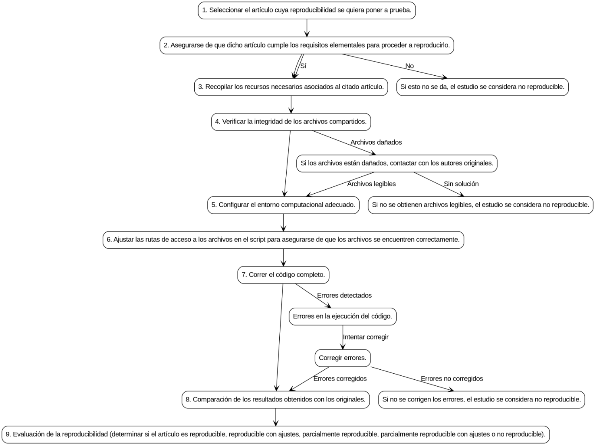

**Abstract**

There is a crisis of reproducibility in multiple branches of science. Among other problems, difficulties in getting the same results out of the same data and code of the original studies have been found – that's what is called “Computational reproducibility”. Given its social relevance, this study has focused on the cases of computational reproducibility in neuroeconomics and behavioral finance. The result is that 58.6% of the studies could not be fully reproduced. Based on the experience acquired, a protocol for systematically assessing computational reproducibility is proposed.

Keywords: behavioral economics, behavioral finance, computational reproducibility, decision making, neuroeconomics, open science.

### **Introduction**

**Context and Motivation**

There are certain disagreements, as well as some ambiguity, in the definition of the concepts *reproducibility*, *computational reproducibility*, and *replicability*. To avoid confusion, these concepts will be defined here, with nuances, according to Kitzes et al. (2017) as follows: reproducibility is “*the ability of a researcher to duplicate the results of a prior study using the same materials as were used by the original investigator. That is, a second researcher might use the same raw data to build the same analysis files and implement the same statistical analysis in an attempt to yield the same results.*” More specifically, computational reproducibility (CR) means that “*a second investigator (including you in the future) can recreate the final reported results of the project, including key quantitative findings, tables, and figures, given only a set of files and written instructions*,” to which I add the necessity of using the same computational environment, i.e., the same software versions, operating system, and hardware of the original study (Vallet et al., 2022). For its part, replicability “*refers to the ability of a researcher to duplicate the results of a prior study if the same procedures are followed but new data are collected*.” All are fundamental for validating scientific knowledge and avoiding drawing incorrect conclusions. The digital age we live in should facilitate them by allowing everything necessary to carry out the different processes to be shared online.

**Reproducibility Crisis**

However, some authors point out a *reproducibility crisis* (Miyakawa, 2020; Munafò et al., 2017; Vallet et al., 2022) in various fields of knowledge and a situation where a large “proportion of peer-reviewed preclinical studies cannot be reproduced” (McNutt, 2014, p. 1). Regarding CR, what was said in the previous section does not seem to be met even when starting with the same data (Oza, 2023). This situation is aggravated when the data either do not exist or are not publicly offered (Miyakawa, 2020), the code used to analyze them is not accessible (Culina et al., 2020), or the original authors do not collaborate when contacted for this purpose (Hardwicke et al., 2021).

It also happens that over time the difficulties in reproducing studies grow exponentially (Vines et al., 2014) for various reasons: links stop working (Hardwicke et al., 2018), databases are lost or are on inaccessible multimedia devices for various reasons (geographic location, not having the necessary software to read said devices...), authors change jobs/email addresses making contact difficult, etc. Another obstacle to CR is mentioned by Vallet et al. (2022): both software and hardware evolve rapidly, making it difficult to reproduce articles published 10 years ago, which makes it essential that environments are shared just as code or databases are shared.

**Open Science and *FAIR* Principles**

The factors cited in the previous paragraph are an obstacle to reproducing studies, and the FAIR principles (*Findable, Accessible, Interoperable, Reusable*) emerged as a response to the need to improve data management and reuse in a constantly growing digital ecosystem (Wilkinson et al., 2016). These principles focus on ensuring that the data collected are accessible and usable by both humans and machines. Other authors (Hasselbring et al., 2019) have extended the concept to the software used in research. By providing concrete guidelines for the production and publication of data and code, these principles foster transparency and scientific reproducibility, in addition to promoting the integration and reuse of data in subsequent research. This allows overcoming traditional barriers in data discovery and use, promoting a more efficient and collaborative ecosystem in current science.

The FAIR principles can be framed within a larger movement: Open Science, which is “*the process of making the content and process of producing evidence and claims transparent and accessible to others*” (Munafò et al., 2017, p. 5), whose objective is to ensure that all published studies are reproducible.

**Scientific Rigor, Behavioral Finance, and Neuroeconomics**

In addition to the problem that the foregoing poses for the advancement of science itself as a collective enterprise (Domínguez, 2017; Munafò et al., 2017), a kind of collateral damage can occur when knowledge that does not have the rigor expected of the scientific method is used to take measures that have a direct impact on people's lives. Economic sciences are an example of this and are not an exception to the rule: Chang & Li (2015) could only replicate the key results of 22 out of the 59 ($\approx 37.3\%$) articles they studied; after publishing *Capital in the Twenty-First Century*, Thomas Piketty (2014) received criticism for “*evidence of pervasive errors of historical fact, opaque methodological choices, and the cherry-picking of sources to construct favorable patterns from ambiguous data*” (Magness & Murphy, 2015, p. 1); the results presented in *Stocks for the Long Run* (Siegel, 2014; Siegel & Schwartz, 2022) regarding the superiority of investing in stocks over fixed income in the long term seem to be based on incomplete data (McQuarrie, 2021, 2023); Duke University closed an investigation in 2024 into the work of behavioral economist Dan Ariely, concluding that he used “data that had been fabricated” in some of his studies, without finding “evidence that Ariely knowingly used false data” (Taylor, 2024).

If the reproducibility crisis is a problem in any discipline, in this case it would be aggravated by the social relevance of its practical applications: the Government Pension Fund of Norway manages around \$1.8 trillion (Reuters, 2024); 15.3% of Spaniards have part of their savings in a pension plan (Funds Society, 2024); Germany recently announced a reform to invest part of the money that guarantees its citizens' future pensions in the stock market (Conde-Batalla, 2024); etc., etc. One must ask where the managers of these huge amounts of money, on which the well-being and quality of life of future retirees will partially depend, extract their knowledge. And if the answer is *from studies that do not meet the standards of the scientific method*, we could be facing a serious problem.

Although work on economic inequality in society has little interest in asset management, the same is not true for the various disciplines that somehow integrate psychology and/or neuroscience with economic sciences (neuroeconomics, behavioral finance, neuromarketing, etc.), whose emphasis on decision-making processes and the biases associated with them are directly related to investment practice: a person analyzing an asset that has been on a long upward streak must be careful that the recency bias does not lead them to think it is a good investment just because it has been rising lately (or the opposite, if the streak has been downward) regardless of what a cold and rigorous analysis of that asset says; if the person in charge of analyzing whether it is a good time or not to buy shares of Harley-Davidson or Ferrari is a motor enthusiast, they must be cautious that the confirmation bias does not make them see an opportunity that does not really exist due to their personal preferences. Etc, etc.

In addition to having this direct relationship, these disciplines have become popular partly due to the publication of popular science books, such as Kahneman (2011), and partly because some of their researchers have won the Sveriges Riksbank Prize in Economic Sciences in Memory of Alfred Nobel (popularly and erroneously known as the *Nobel in Economics*): Daniel Kahneman (2002), Robert J. Shiller (2013), and Richard H. Thaler (2017). Consequently, non-professional investors can also be expected to be familiar with them and use this knowledge with the aim of increasing their wealth.

**Objectives**

Two objectives are pursued: the first, secondary, is to evaluate the reproducibility of particular case studies. This is essential to acquire the necessary experience that leads to the main objective: to propose, based on said experience, a protocol for evaluating the computational reproducibility of scientific articles. In particular, to apply this evaluation to publications related to areas of knowledge in which psychology and/or neurobiology overlap with economic sciences.

### Methods and Materials

**Procedure and Materials**

First, a series of articles will be selected whose CR will be tested following the authors' instructions. These will be the case studies referred to in the *Objectives* section. The code will be executed on the data, and the results encountered (code failures, problems with files to be read, etc.) will be recorded in a field journal. Each of these steps is detailed in a subsequent section.

Software and Operating System Specifications Across Articles

| Aspect                   |                                    |
|--------------------------|------------------------------------|
| Operating system         | Linux Mint 22.3 *Zena.*            |
| Error resolution support | ChatGPT-5o.                        |
| Unavailability policy    | Process suspended until available. |
| R version                | 4.5.3 “Reassured Reassurer”.       |
| RStudio version          | 2026.01.0+392.                     |

The different versions of the files used will be controlled at [[https://github.com/Nestor-S-G/openscience]{.underline}](https://github.com/Nestor-S-G/openscience).

**Selection of Articles for Reproduction**

Incidental sampling will be used with the following criteria:

a\) Being an article whose subject matter falls within the previously mentioned areas, according to the author's expert criteria. Those that include the keywords: *behavioral finance, behavioral economics, decision making,* and *neuroeconomics* will be sought.

b\) Being published in 2005 or a later date, as this was when the credibility of many scientific publications began to be questioned (Ioannidis, 2005).

Due to the fact that a little-researched topic is being addressed, it is not considered appropriate to add more criteria that restrict degrees of freedom and exclude articles with the potential to be tested in this study.

**Reproduction**

Once the articles are selected, an attempt will be made to reproduce them from scratch following the given instructions using a bottom-up process.

**Field Journal**

The present study will be documented in the format of a field journal (Sampieri et al., 2010). This form of record is suitable for documenting the steps taken in the attempt at reproduction. It will include the problems that may be found throughout the process, as well as the way of trying to solve them through trial and error, which will be noted with their results, positive or negative. The difficulties recorded in the field journal will serve to develop the protocol to be followed from now on.

The recurring themes and patterns that emerge in a first reading of the journal will be coded in a spreadsheet. A systematic qualitative analysis will then be applied to them.

## **Results**

**Case Studies**

29 articles were selected to test their computational reproducibility.

**Field Journal Analysis**

The analysis of the field journal resulted in the following thematic categories: *data not shared*, *software incompatibility, issues related to files analyzed, code-related problems, proprietary software dependency*, and *lack of analysis documentation*, which were grouped into the supercategory *Errors*. The *Results* obtained are divided among all categories.

Coding:

| Errors                           | Number of errors (n = 52) |
|----------------------------------|---------------------------|
| Software incompatibility         | 2                         |
| Issues related to files analyzed | 3                         |
| Code-related problems            | 9                         |
| Data not shared                  | 15                        |
| Proprietary software dependency  | 9                         |
| Lack of analysis documentation   | 15                        |

Results:

| Reproducibility outcome                   | Number of studies (n = 29) |
|-------------------------------------------|----------------------------|
| Non-reproducible                          | 15                         |
| Partially reproducible                    | 2                          |
| Partially reproducible with modifications | 6                          |
| Reproducible                              | 1                          |
| Reproducible with modifications           | 0                          |
| Non-evaluable                             | 5                          |

Regarding software incompatibility errors, in Payzan-LeNestour and Doran (2024) it is very possible that the problem is due to the lack of a computational environment, as the closest thing offered are two versions of Python libraries. As Vallet et al. (2022, p. 1) point out: “*While names and version labels are a step toward transparency, they are insufficient to allow any future user to rebuild the computational environment on which these software are running*”. It is also striking that, instead of providing the exact versions used, the “\>=” is used, implying that any version yet to be developed will continue to adapt to the formats used. This is what is called *backward compatibility* and one of the problems found in said study has been, precisely, that the .xls format in which the data is offered is losing ground against .xlsx and that made it incompatible with the most recent versions of the xlrd library in Python. A software problem was also found in Payzan-LeNestour et al. (2024), however, this only required substituting one function with its equivalent in Linux.

In the case of Fareri et al. (2022), the indicated version of the mriqc package could not be found, but a later one. Although the problem with this study was of another nature, this may have affected the results in some way. These examples serve to recall the importance of sharing the computational environment already mentioned.

As for the problems related to the files to be analyzed, they insurmountably hindered the attempt to reproduce the article by Payzan-LeNestour and Woodford (2022), due to the lack of a necessary .csv file, and that of Fareri et al. (2022), where the following errors were found when checking if the material complied with the *Brain Image Data Structure* ('BIDS') standard: “*There is a mismatch between the participant IDs defined in the participants.tsv file and other files in the dataset*” and “*The file names in the scan TSVs do not match the files present in the dataset*,” both literal quotes from the field journal. It is possible that the article by Payzan-LeNestour and Doran (2024) could have been reproduced if an .xlsx format had been used instead of .xls, but this is only a hypothesis.

Finally, code errors occurred in all four cases, but these were easily resolved and do not appear to be the cause of any of the unsuccessful attempts at reproduction.

It is worth noting the authors' willingness to share their material, thus contributing to the advancement of Open Science: Fareri et al. (2022) used openneuro.org and identifiers.org to store materials, and Payzan-LeNestour and Doran (2024) assigned a *Digital Object Identifier* or "DOI" (Wilkinson et al., 2016), complying with the FAIR principles of *Findable* and *Accessible*. However, the materials from Payzan-LeNestour and Woodford (2022) are uploaded to Dropbox and those from Payzan-LeNestour et al. (2024) to the Open Science Framework website. This is better than not sharing them, but it is also not the optimal way to do so since they could disappear from the network at any moment.

**Protocol**

From the previous analysis, the protocol represented in Figure 1 is extracted:

*Figure 1. Image of the flow chart created with the help of ChatGPT-4o (IN SPANISH).*

Whose steps are detailed below:

\-*Select the article whose reproducibility is to be tested.*

\-*Ensure that the article meets the essential requirements to proceed with reproduction*. If essential material is missing, it can be concluded at this point that the article is not reproducible.

\-*Gather the necessary resources associated with the cited article.*

\-*Verify the integrity of the shared files*. If any of the files are unreadable or the data are mismatched, the article is not reproducible from this point.

\-*Configure the appropriate computational environment.*

\-*If necessary, adjust the file access paths in the script to ensure the files are correctly located*. It might be that the code was written to read the necessary resources online, and this step would be unnecessary.

\-*Run the complete code*. If an error is reached, try to resolve it and run the code again. If the error is irresolvable, the article is deemed non-reproducible.

\-*Comparison of the obtained results with the originals.*

\-*Evaluation of reproducibility: reproducible, reproducible with modifications, partially reproducible, partially reproducible with modifications, or non-reproducible*. Defined below:

-Reproducible: A study that meets the definition given at the beginning of this article: reaching consistent results (identical or with errors due exclusively to rounding) starting from the material provided by the original authors and their instructions, with no modifications other than adjusting the paths for reading the files if necessary or other superficialities that do not substantially affect the given material.

-Reproducible with modifications: Consistent results have been reached, but with modifications that go beyond the instructions given or the path adjustment, such as the rewriting of part of the algorithm that must process the data.

-Partially reproducible: The case where only a part of the study is reproduced, either because the results in the other part diverge from the originals, or because they cannot be obtained due to technical failures (requirement of a specific library or package to analyze that part of the data that is no longer available, or similar).

-Partially reproducible with modifications: A case analogous to the previous one, but where modifications in the given code were necessary to achieve that partial reproduction.

-Non-reproducible: Either different results from the originals are reached, or no results are reached for whatever reason (failures in reading the files, impossibility of recreating the computational environment or a sufficiently similar one that allows the code to run, etc.).

-Non-evaluable: Materials are shared, but its reproducibility couldn't be assesed for various reasons, for instance, being shared in proprietary software not everyone has access to.

### **Discussion**

**Obstacles**

Among the problems found are the lack of knowledge of the complete computational environment required, leading to incompatibilities when reading files (Payzan-LeNestour and Doran, 2024); the impossibility of accessing exact versions because they have become obsolete and are no longer found in official repositories, problems with the material to be reproduced (Fareri et al., 2022); or not having part of the necessary data nor obtaining collaboration from the authors to overcome this obstacle (Payzan-LeNestour and Woodford, 2022). Although the latter is a secondary aspect not included in the definition of CR (Kitzes et al., 2017, p. xxii), Hardwicke et al. (2021) managed to reproduce 24% of the articles in their study this way, so in the absence of good initial practice that makes them dispensable, it could have been an acceptable alternative to complete the process. It can be said that having the collaboration of the original authors allowed for reproductions that, in turn, facilitate computational reproducibility in the future.

**Future Suggestions**

The following conclusions are drawn from the entire process, which can serve as a guide for future 'reproducers':

-   Verifying the integrity of the available files at the beginning of the process can save time later. Had the BIDS structure of the folders and files provided to reproduce the study by Fareri et al. (2022) been checked first, it could have been concluded in minutes that it could not be reproduced. One of the errors associated with the article by Payzan-LeNestour and Doran (2024) might have been due to the .xls files being damaged, according to the possibilities offered by ChatGPT-4o. Although this was not the case, it would have been good to check it first to rule it out. If the files were damaged, the original authors could be contacted in case they wanted to remedy it and share functional files online.

-   In case of not having the necessary information to install a software computational environment like that of the original study, it can be approximated by searching for the latest stable versions available at the time of the article's publication, taking into account that this could be the cause of the error. Should the article not be reproducible and whatever the result, this fact must be recorded.

-   Any error when running the code must be meticulously documented, as well as the solutions that are applied, whether they are useful or not. For this, the simplest and most congruent with the principles of open science is to use a code version control system (Sandve et al., 2013). Those unfamiliar with computer programming may find typical file names unintelligible, so it would be desirable to make these as clear as possible.

With respect to authors who want to make their studies computationally reproducible, most of the inconveniences encountered could be resolved with the use of reproducible computational environments like Guix (Vallet et al., 2022), so that would be a path to explore. That article mentions the limitations of containers like Docker or Singularity, especially due to the difficulty of maintaining them in the long term. This must be taken into account if one chooses to share the environment in that way.

Interactive notebooks or computational documents (JupyterLab, Quarto, R Markdown, etc.) make it easier for other researchers to reproduce our studies by integrating code, text, and graphics into a single document.

Regarding the way to share necessary files, ideally, they should be stored in a public repository with some type of persistent identifier, such as those cited above, and for the code itself to include the URL where they are hosted as the file path. This would reduce the manual steps that the study reproducer has to carry out (a potential source of errors), standardizing the process. Having said that, given that internet connection can be unstable in certain parts of the world, this could be a setback. One solution could be the use of relative file paths instead of absolute ones (Perry, 2022) in the code. Said code would check for the existence of the file in a subfolder included in the materials to be downloaded and, if it does not exist, would proceed to download it from the URL. A textbox that asks for the path to be entered without modifying the code could also be an alternative to consider.

The use of open-source software is also important for the development of open science - when authors share materials that require proprietary software, such as Alem et al. (2023) or Hilbert et al. (2022), an invisible barrier for reproducibility is raised, especially for scientists working in countries where the price is prohibitive.

It is also important to accompany the files with the corresponding legends, since without these the interpretation of the data becomes an extremely difficult, if not impossible, task for someone outside the original study.

Finally, Pauls and Laudi (2025) didn't share the materials of their study due to privacy agreements. This is a sensible issue. There are some ways to share the data while respecting the anonymity of the subjects (anonymization, avatarization) that should be considered before ruling out the possibility of sharing data.

**Generalization to Other Disciplines**

Although the definition of *computational reproducibility* given includes the use of the same hardware as part of the *computational environment*, a distinction should be made between disciplines, such as physics, on the one hand, and behavioral sciences on the other. The computational precision of the former may make the use of the same equipment essential to arrive at the same result, while for the latter, reaching such a fundamental level may be unnecessary, especially when standardized software adapted to multiple platforms (e.g., R and its libraries) is used. Point in case: Borsboom et al. (2024), Hermann et al. (2025), and Mischkowski et al. (2021) were reproduced with code written by the authors, without knowledge of the software and versions used in the original analysis.

Consequently, the results of the present study could be generalized to other social, behavioral, and health sciences, but cannot be extrapolated to natural sciences without further consideration.

**Limitations and Conclusion**

Among the limitations of the present study is its low representativeness, accentuated by the fact that some articles share authors (Payzan-LeNestour and Doran (2024), Payzan-LeNestour and Woodford (2022), Payzan-LeNestour et al. (2024), Huber and Huber (2020), and Huber et al. (2021)), although not all yielded the same result, what mitigates the potential bias. If Open Science advances and the number of publications that share everything necessary to reproduce the code and arrive at their same results increases exponentially, studies with greater representativeness and inferences with sufficient statistical power could be carried out in the future. Also with strict inclusion and exclusion criteria: one that aims to delve deeper into a specific discipline (behavioral economics, behavioral finance, neuroeconomics, etc.) or adhere to a narrower time window. Once more studies are available, the aggregated experience of the authors could lay the groundwork for proposing a standardized instrument with which to carry out computational reproductions.

The results obtained support that the reproducibility crisis referenced in the *Introduction* also affects neuroeconomics and behavioral finance, at least with regard to computational reproducibility: several of the problems pointed out in the literature were found, and the result was that most of the selected studies could not be reproduced.

### **Bibliographical References**

Alem, Y., Hassen, S. & Köhlin, G. (2023). Decision-making within the household: The role of division of labor and differences in preferences. *Journal of Economic Behavior and Organization, 207*, 511-528. <https://doi.org/10.1016/j.jebo.2023.01.022>

Aydogan, I., Berger, L., & Théroude, V. (2024).Pay all subjects or pay only some? An experiment on decision-making under risk and ambiguity. *Journal of Economic Psychology, 104*, 102757. <https://doi.org/10.1016/j.joep.2024.102757>

Blijlevens, J., Chuah, S., Neelim, A., Prasch, J. E, & Skali, A. (2024). Not all about the money: Service quality information improves consumer decision-making. *Journal of Economic Behavior and Organization, 228*, 106769. <https://doi.org/10.1016/j.jebo.2024.106769>

Barrafrem, K., Västfjäll, D., & Tinghög, G.. (2021). The arithmetic of outcome editing in financial and social domains. *Journal of Economic Psychology, 86*, 102408. <https://doi.org/10.1016/j.joep.2021.102408>

Borsboom, C., Duxbury, D., Nieber, A., & Zeisberger. (2024). Domain-dependent diversification: The influence of gain–loss domain on correlation choice. *Journal of Economic Behavior and Organization, 227*, 106681. <https://doi.org/10.1016/j.jebo.2024.106681>

Chang, A.C., & Li, P. (2015). Is economics research replicable? Sixty published papers from thirteen journals say “usually not”. *Finance and Economics Discussion Series 2015, 83*. [[http://doi.org/10.17016/FEDS.2015.083]{.underline}](http://dx.doi.org/10.17016/FEDS.2015.083)

Culina, A., van den Berg, I., Evans. S., & Sánchez-Tójar, A. (2020). Low availability of code in ecology: A call for urgent action. *PLOS Biology, 18*(7), e3000763. [[https://doi.org/10.1371/journal. Pbio.3000763]{.underline}](https://doi.org/10.1371/journal.%20pbio.3000763)

Conde-Batalla, L. (2024, marzo 13). Revolución en las pensiones europeas: Alemania invierte en acciones, Suiza vota una paga extra. *Cinco Días*. Recuperado de [[https://cincodias.elpais.com/opinion/2024-03-13/revolucion-en-las-pensiones-europeas-alemania-invierte-en-acciones-suiza-vota-una-paga-extra.html]{.underline}](https://cincodias.elpais.com/opinion/2024-03-13/revolucion-en-las-pensiones-europeas-alemania-invierte-en-acciones-suiza-vota-una-paga-extra.html)

De Bresser, J., & Knoef, M. (2025). Different defaults affect different groups differently. *Journal of Economic Behavior and Organization*, *231*, 106876. <https://doi.org/10.1016/j.jebo.2024.106876>

Domínguez, N. (2017). La ciencia vive una epidemia de estudios inservibles. *Elpais.com*. Recuperado de [[https://elpais.com/elpais/2017/01/10/ciencia/1484073680_523691.html]{.underline}](https://elpais.com/elpais/2017/01/10/ciencia/1484073680_523691.html)

Ekström, M., Bjorvatn, K., Mota, P. S., & Sjåstad, H. (2025). Making a promise increases the moral cost of lying: Evidence from Norway and the United States. *Journal of Economic Behavior and Organization*, *233*, 106995. <https://doi.org/10.1016/j.jebo.2025.106995>

Fareri, D. S., Hackett, K., Tepfer, L. J., Kelly, V., Henninger, N., Reeck, C., Giovannetti, T. & Smith, D. V. (2022). Age-related differences in ventral striatal and default mode network function during reciprocated trust. *NeuroImage, 256*. [[https://doi.org/10.1016/j.neuroimage.2022.119267]{.underline}](https://doi.org/10.1016/j.neuroimage.2022.119267)

Fišar, M., Cingl, L., Reggiani, T., Kundtová-Klocová, E., Kundt, R., Krátký, J., Kostolanská, K., Bencúrová, P., Kudličková Pešková, M., & Marečková, K. (2023). Ovulatory shift, hormonal changes, and no effects on incentivized decision-making. *Journal of Economic Psychology, 98*, 102656.

Fred Van Raaij, W., Antonides, G., & Manon De Groot, I. (2020). The benefits of joint and separate financial management of couples. *Journal of Economic Psychology, 80*, 102313. <https://doi.org/10.1016/j.joep.2020.102313>

Fu, F, Grant, L. H., Hortaçsu, A., Keysar, B., Yang, J., & Ye, K. J. (2025). The impact of language on decision-making: Auction winners are less cursed in a foreign language. *Journal of Economic Psychology, 110*, 102845. <https://doi.org/10.1016/j.joep.2025.102845>

Fundssociety.com. (2024, octubre 4). Más del 15% de los españoles ahorran para su jubilación con un plan de pensiones individual. *Funds Society*. Recuperado de [[https://www.fundssociety.com/es/formate-a-fondo/mas-del-15-de-los-espanoles-ahorran-para-su-jubilacion-con-un-plan-de-pensiones-individual/]{.underline}](https://www.fundssociety.com/es/formate-a-fondo/mas-del-15-de-los-espanoles-ahorran-para-su-jubilacion-con-un-plan-de-pensiones-individual/)

Hardwicke, T. E., Mathur, M. B., MacDonald, K., Nilsonne, G., Banks, G. C., Kidwell, M. C., Hofelich Mohr, A., Clayton, E., Yoon, E. J., Tessler, M. H., Lenne, R. L., Altman, S., Long, B., & Frank, M. C. (2018). Data availability, reusability, and analytic reproducibility: Evaluating the impact of a mandatory open data policy at the journal *Cognition*. *Royal Society Open Science*, *5*(8), 180448. [[https://doi.org/10.1098/rsos.180448]{.underline}](https://doi.org/10.1098/rsos.180448)

Hardwicke, T. E., Bohn, M., MacDonald, K., Hembacher, E., Nuijten, M. B., Peloquin, B. N., deMayo, B. E., Long, B., Yoon, E. J., & Frank, M. C. (2021). Analytic reproducibility in articles receiving open data badges at the journal Psychological Science: An observational study. *Royal Society Open Science, 8*(1), 201494. [[https://doi.org/10.1098/rsos.201494]{.underline}](https://doi.org/10.1098/rsos.201494)

Hasselbring, W., Carr, L., Hettrick, S., Packer, H., & Tiropanis, T. (2019). *FAIR and Open Computer Science Research Software*. arXiv. [[https://arxiv.org/abs/1908.05986]{.underline}](https://arxiv.org/abs/1908.05986)

Hausfeld, J., Fischbacher, U., & Knoch, D. (2020). The value of decision-making power in social decisions. *Journal of Economic Behavior and Organization, 177*, 898–912. <https://doi.org/10.1016/j.jebo.2020.06.018>

Hermann, D., Bruns, S., & Mußhoff, O. (2025). Card or dice? An improved experimental approach to measure dishonest. *Journal of Economic Psychology, 108*. <https://doi.org/10.17605/OSF.IO/ZHNX2>

Hilbert. L. P., Noordewier, K. M., & Van Dijk, W. W. (2022). Financial scarcity increases discounting of gains and losses: Experimental evidence from a household task. *Journal of Economic Psychology, 92*, 102546. <https://doi.org/10.1016/j.joep.2022.102546>

Huber, C., & Huber, J. (2020). Bad bankers no more? Truth-telling and (dis)honesty in the finance industry. *Journal of Economic Behavior and Organization, 180*. <https://doi.org/10.17605/OSF.IO/C9DBJ>

Huber, C., Huber, J., & Kirchler, M. (2021). Volatility shocks and investment behavior. *Journal of Economic Behavior and Organization, 194*, 56-70. <https://doi.org/10.1016/j.jebo.2021.12.007>

Ioannidis, J. P. A. (2005). Why Most Published Research Findings Are False. *PLoS Medicine, 2*(8), e124. [[https://doi.org/10.1371%2Fjournal.pmed.0020124]{.underline}](https://doi.org/10.1371%2Fjournal.pmed.0020124)

Kahneman, D. (2011). *Thinking, Fast and Slow.* Farrar, Straus and Giroux.

Kitzes, J., Turek, D., & Deniz, F. (2017). The practice of reproducible research: Case studies and lessons from the data-intensive sciences. *Oakland: University of California Press*.

Löfgren, Å., & Nordblom, K. (2020). A theoretical framework of decision making explaining the mechanisms of nudging. *Journal of Economic Behavior and Organization, 174*, 1–12. <https://doi.org/10.1016/j.jebo.2020.03.021>

Mischkowski, D., Glöckner, A., & Lewisch, P. (2021). Information search, coherence effects, and their interplay in legal decision making. *Journal of Economic Psychology, 87*, 102445. <https://doi.org/10.1016/j.joep.2021.102445>

Magness, P. & Murphy, R. P. (2015). Challenging the Empirical Contribution of Thomas Piketty's Capital in the 21st Century. *Journal of Private Enterprise, 15*(2).

McNutt, M. (2014). Reproducibility. *Science, 343*(6168), 229. [[https://doi.org/10.1126%2Fscience.1250475]{.underline}](https://doi.org/10.1126%2Fscience.1250475)

McQuarrie, E. F. (2021). Where Siegel Went Awry: Outdated Sources & Incomplete Data. *SSRN.* [http://doi.org/10.2139/ssrn.3805927](https://dx.doi.org/10.2139/ssrn.3805927)

McQuarrie, E. F. (2023). Stocks for the Long Run? Sometimes Yes, Sometimes No. *Financial Analysts Journal, 80*(1).

Merguei, N., Strobel, M., & Vostroknutov, A. (2022). Moral opportunism as a consequence of decision making under uncertainty. *Journal of Economic Behavior and Organization, 197*, 624–642. <https://doi.org/10.1016/j.jebo.2022.03.020>

Miyakawa, T. (2020). No raw data, no science: another possible source of the reproducibility crisis. *Molecular Brain, 13*(1), 1-6. [[https://doi.org/10.1186/s13041-020-0552-2]{.underline}](https://doi.org/10.1186/s13041-020-0552-2)

Munafò, M. R., Nosek, B. A., Bishop, D. V. M., Button, K. S., Chambers, C. D., Percie du Sert, N., Simonsohn, U., Wagenmakers, E.-J., Ware, J. J., & Ioannidis, J. P. A. (2017). A manifesto for reproducible science. *Nature Human Behaviour, 1*(1), 1-9. [[https://doi.org/10.1038/s41562-016-0021]{.underline}](https://doi.org/10.1038/s41562-016-0021)

Negrini, M., Riedl, A., & Wibral, M. (2022). Sunk cost in investment decisions. *Journal of Economic Behavior and Organization, 200*, 1105–1135. <https://doi.org/10.1016/j.jebo.2022.06.028>

Oza, A. (2023). Reproducibility trial: 246 biologists get different results. *Nature*. [[https://www.nature.com/articles/d41586-023-03177-1]{.underline}](https://www.nature.com/articles/d41586-023-03177-1)

Pauls, T., & Laudi, M. (2025). Temporal framing of tax stimuli and household consumption. *Journal of Economic Behavior and Organization, 235*, 107079. <https://doi.org/10.1016/j.jebo.2025.107079>

Payzan-LeNestour, E. & Doran, J. (2024). Craving money? Evidence from the laboratory and the field. *Sciences Advances, 10*(2), eadi5034. [[http://doi.org/10.1126/sciadv.adi5034]{.underline}](http://doi.org/10.1126/sciadv.adi5034)

Payzan-LeNestour, E. & Woodford, M. (2022). Outlier blindness: A neurobiological foundation for neglect of financial risk. *Journal of Financial Economics, 143*(3), 1316-1343. [[https://doi.org/10.1016/j.jfineco.2021.06.019]{.underline}](https://doi.org/10.1016/j.jfineco.2021.06.019)

Payzan-LeNestour, E., Yang, Y., Thelaus, S. & Balleine, B. (2024). Stubborn by Design: Neurobiological Foundation of Maladaptive Risk-Taking at Downturn Onsets. *SSRN*. [[https://doi.org/10.2139/ssrn.5041683]{.underline}](https://dx.doi.org/10.2139/ssrn.5041683)

Perry, K. (2022, January 10). Understanding Relative File Paths. *Coding Rooms.* Recuperado de [[https://www.codingrooms.com/blog/file-paths]{.underline}](https://www.codingrooms.com/blog/file-paths)

Piketty, T. (2014). *Capital in the Twenty-First Century* . Belknap Press: An Imprint of Harvard University Press.

Reuters. (2024, diciembre 6). Norway wealth fund hits record 20 trillion crowns. *Reuters.* [[https://www.reuters.com/business/finance/norway-wealth-fund-hits-record-20-trillion-crowns-2024-12-06/]{.underline}](https://www.reuters.com/business/finance/norway-wealth-fund-hits-record-20-trillion-crowns-2024-12-06/)

Sampieri, R. H., Collado, C. F. y Lucio, P. B. (2010). *Metodología de la investigación* (5ª Edición). McGraw Hill.

Sandve, G. K., Nekrutenko, A., Taylor, J. & Hovind, E. (2013). Ten simple rules for reproducible computational research. *PLOS Biology, 9*(10), e1003285. [[https://doi.org/10.1371/journal.pcbi.1003285]{.underline}](https://doi.org/10.1371/journal.pcbi.1003285)

Siegel, J. J. (2014). *Stocks for the Long Run: The Definitive Guide To Financial Market Returns & Long-Term Investment Strategies* (5th Edition). McGrawHill.

Siegel, J. J. & Schwartz, J. (2022). *Stocks for the Long Run: The Definitive Guide To Financial Market Returns & Long-Term Investment Strategies* (6th Edition). McGrawHill.

Snijder, L. L., Stallen, M., & Gross, J. (2024). Decision-makers self-servingly navigate the equality-efficiency trade-off of free partner choice in social dilemmas among unequals. *Journal of Economic Psychology, 105*. <https://doi.org/10.17605/OSF.IO/3WRSU>

Steinel, W., Valtcheva, K., Gross, J., Celse, J., Max, S., & Shalvi, S. (2022). (Dis)honesty in the face of uncertain gains or losses. *Journal of Economic Psychology, 90*, 102487. <https://doi.org/10.1016/j.joep.2022.102487>

Tang, N. (2021). Cognitive abilities, self-efficacy, and financial behavior. *Journal of Economic Psychology, 87*, 102447. <https://doi.org/10.1016/j.joep.2021.102447>

Taylor, K. (2024). Duke's 3-year fraud investigation into Dan Ariely has ended, and the star professor still has a job. Does he want it?. *Business Insider.* [[https://www.businessinsider.com/dan-ariely-duke-fraud-investigation-2024-2]{.underline}](https://www.businessinsider.com/dan-ariely-duke-fraud-investigation-2024-2)

Vallet, N., Michonneau, D., & Tournier, S. (2022). Toward practical transparent verifiable and long-term reproducible research using Guix. *Scientific Data, 9*(1), 597. [[https://doi.org/10.1038/s41597-022-01720-9]{.underline}](https://doi.org/10.1038/s41597-022-01720-9)

Vines, T. H., Albert, A. Y. K., Andrew, R. L., Débarre, F., Bock, D. G., Franklin, M. T., Gilbert, K. J., Moore, J. S., Renaut, S. & Rennison, D. J. (2014). The Availability of Research Data Declines Rapidly with Article Age. *Current Biology, 24*(1), 94-97. [[https://doi.org/10.1016/j.cub.2013.11.014]{.underline}](https://doi.org/10.1016/j.cub.2013.11.014)

Wang, Y., Driouchi, T., & Nguyen, D. D. (Louis). (2025). Parental death in childhood and stock market participation: Cross-cultural insights. *Journal of Economic Behavior and Organization, 236*, 107078. <https://doi.org/10.1016/j.jebo.2025.107078>

Wilkinson, M. D., Dumontier, M., Aalbersberg, I. J., Appleton, G., Axton, M., Baak, A., ... & Mons, B. (2016). The FAIR Guiding Principles for scientific data management and stewardship. *Scientific Data, 3*(1), 160018. [[https://doi.org/10.1038/sdata.2016.18]{.underline}](https://doi.org/10.1038/sdata.2016.18)

Zhang, X., Aimone, J. A., Alsharawy, A., Li, F., Ball, S., & Smith, A. (2024). The effects of task difficulty and presentation format on eye movements in risky choice. *Frontiers in Behavioral Economics, 3*, 1321301. <https://doi.org/10.3389/frbhe.2024.1321301>
